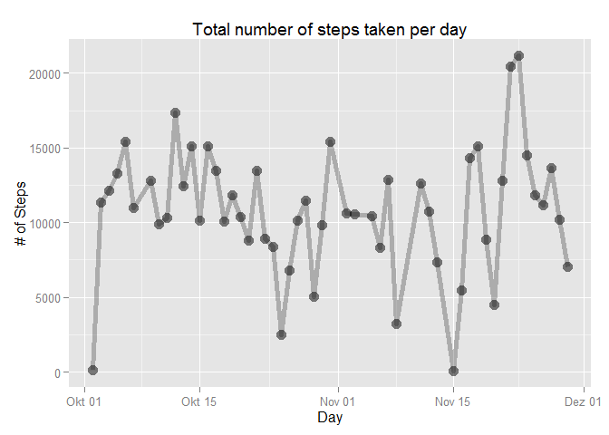

# Reproducible Research: Peer Assessment 1


## Loading and preprocessing the data

```r
library(dplyr, quietly = TRUE, warn.conflicts = FALSE)
zipfile <- "activity.zip"
if(!file.exists(zipfile)) 
{
  print("error: file does not exist")
}
data.raw <- tbl_df(read.csv(unz(zipfile, "activity.csv"), 
                  col.names=c("steps", "date", "interval"),
                  colClasses=c("numeric", "POSIXct", "numeric"),
                  stringsAsFactors=FALSE, 
                  header=TRUE))
data <- data.raw %>% filter(!is.na(steps))
str(data)
```

```
## Classes 'tbl_df', 'tbl' and 'data.frame':	15264 obs. of  3 variables:
##  $ steps   : num  0 0 0 0 0 0 0 0 0 0 ...
##  $ date    : POSIXct, format: "2012-10-02" "2012-10-02" ...
##  $ interval: num  0 5 10 15 20 25 30 35 40 45 ...
```


## What is mean total number of steps taken per day?

```r
library(ggplot2)
library(scales)

stepsPerDay <- data %>% group_by(date) %>% summarize(mn = mean(steps))
g <- ggplot(stepsPerDay, aes(date, mn)) +
      geom_line(size=2, alpha=1/4) +
      geom_point(size = 4, alpha = 1/2)  +	
      labs(title = "Mean number of steps taken per day") +
      labs(x = "Day", y = "Mean # of Steps")

print(g)
```

 

## What is the average daily activity pattern?


## Imputing missing values


## Are there differences in activity patterns between weekdays and weekends?
