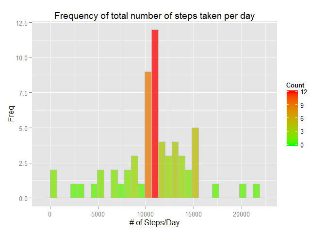
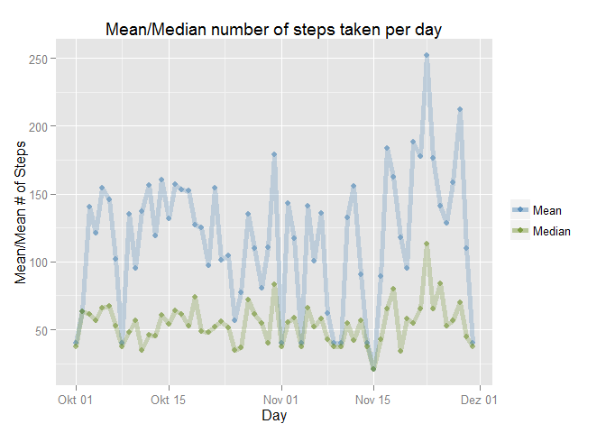
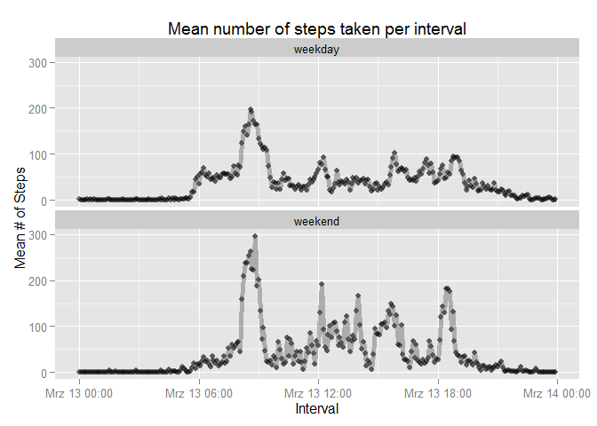

# Reproducible Research: Peer Assessment 1

#```{r setoptions,echo=FALSE}
#opts_chunk$set(echo=TRUE)
#```

## Loading and preprocessing the data

```r
library(dplyr, quietly = TRUE, warn.conflicts = FALSE)
library(ggplot2)
library(scales)
library(lubridate)

zipfile <- "activity.zip"
if(!file.exists(zipfile)) 
{
  print("error: file does not exist")
}
data <- tbl_df(read.csv(unz(zipfile, "activity.csv"), 
                  col.names=c("steps", "date", "interval"),
                  colClasses=c("numeric", "POSIXct", "numeric"),
                  stringsAsFactors=FALSE, 
                  header=TRUE))
rm(zipfile)

str(data)
```

```
## Classes 'tbl_df', 'tbl' and 'data.frame':	17568 obs. of  3 variables:
##  $ steps   : num  NA NA NA NA NA NA NA NA NA NA ...
##  $ date    : POSIXct, format: "2012-10-01" "2012-10-01" ...
##  $ interval: num  0 5 10 15 20 25 30 35 40 45 ...
```


## What is mean total number of steps taken per day?

1. Calculate the total number of steps taken per day


```r
totalStepsPerDay <- data %>% 
                    filter(!is.na(steps) & steps > 0) %>% 
                    group_by(date) %>% 
                    summarize(tot = sum(steps))
totalStepsPerDay
```

```
## Source: local data frame [53 x 2]
## 
##          date   tot
## 1  2012-10-02   126
## 2  2012-10-03 11352
## 3  2012-10-04 12116
## 4  2012-10-05 13294
## 5  2012-10-06 15420
## 6  2012-10-07 11015
## 7  2012-10-09 12811
## 8  2012-10-10  9900
## 9  2012-10-11 10304
## 10 2012-10-12 17382
## 11 2012-10-13 12426
## 12 2012-10-14 15098
## 13 2012-10-15 10139
## 14 2012-10-16 15084
## 15 2012-10-17 13452
## 16 2012-10-18 10056
## 17 2012-10-19 11829
## 18 2012-10-20 10395
## 19 2012-10-21  8821
## 20 2012-10-22 13460
## 21 2012-10-23  8918
## 22 2012-10-24  8355
## 23 2012-10-25  2492
## 24 2012-10-26  6778
## 25 2012-10-27 10119
## 26 2012-10-28 11458
## 27 2012-10-29  5018
## 28 2012-10-30  9819
## 29 2012-10-31 15414
## 30 2012-11-02 10600
## 31 2012-11-03 10571
## 32 2012-11-05 10439
## 33 2012-11-06  8334
## 34 2012-11-07 12883
## 35 2012-11-08  3219
## 36 2012-11-11 12608
## 37 2012-11-12 10765
## 38 2012-11-13  7336
## 39 2012-11-15    41
## 40 2012-11-16  5441
## 41 2012-11-17 14339
## 42 2012-11-18 15110
## 43 2012-11-19  8841
## 44 2012-11-20  4472
## 45 2012-11-21 12787
## 46 2012-11-22 20427
## 47 2012-11-23 21194
## 48 2012-11-24 14478
## 49 2012-11-25 11834
## 50 2012-11-26 11162
## 51 2012-11-27 13646
## 52 2012-11-28 10183
## 53 2012-11-29  7047
```

2. If you do not understand the difference between a histogram and a barplot, research the difference between them. Make a histogram of the total number of steps taken each day


```r
g <- ggplot(totalStepsPerDay, aes(tot)) +
      geom_histogram(alpha=1/4) +      
      labs(title = "Frequency of total number of steps taken per day") +
      labs(x = "# of Steps/Day", y = "Freq") +
      scale_y_continuous(labels = comma)

suppressMessages(print(g))
```

 

```r
rm(g)
rm(totalStepsPerDay)
```


3. Calculate and report the mean and median of the total number of steps taken per day


```r
mStepsPerDay <- data %>% 
                    filter(!is.na(steps) & steps > 0) %>% 
                    group_by(date) %>% 
                    summarize(mn = mean(steps), med=median(steps))

ggplot(mStepsPerDay) +
      geom_line(aes(date, mn, colour="Mean"), size=2, alpha=1/4) +      
      geom_point(aes(date, mn, colour="Mean"), size = 4, alpha = 1/2)  +
      geom_line(aes(date, med, colour="Median"), size=2, alpha=1/4) +
      geom_point(aes(date, med, colour="Median"), size=4, alpha=1/4) +
      labs(title = "Mean/Median number of steps taken per day") +
      labs(x = "Day", y = "Mean/Mean # of Steps") +      
      scale_colour_manual("", 
                      breaks = c("Mean", "Median"),
                      values = c("steelblue", "olivedrab"))
```

 

```r
rm(mStepsPerDay)
```

## What is the average daily activity pattern?


1. Make a time series plot (i.e. type = "l") of the 5-minute interval (x-axis) and the average number of steps taken, averaged across all days (y-axis)


Here I am converting the interval to regulare POSIXct values in order to avoid some shaky graph behavior due to missing intervals


```r
averageSteps <- data %>% 
                filter(!is.na(steps)& steps > 0) %>% 
                mutate(intv=sprintf("%04d", interval)) %>%
                mutate(intv= intv %>% strptime("%H%M") %>% as.character()) %>%
                mutate(intv=ymd_hms(intv)) %>%
                group_by(intv) %>% 
                summarize(mn = mean(steps))

ggplot(averageSteps, aes(intv, mn)) +
      geom_line(size=2, alpha=1/4) +
      geom_point(size = 2, alpha = 1/2)  +  
      labs(title = "Mean number of steps taken per inteval") +
      labs(x = "Interval", y = "Mean # of Steps")
```

 

```r
rm(averageSteps)
```

2. Which 5-minute interval, on average across all the days in the dataset, contains the maximum number of steps?

```r
data %>% 
    filter(!is.na(steps)) %>% 
    group_by(interval) %>% 
    summarize(sm = sum(steps)) %>% 
    top_n(1)
```

```
## Selecting by sm
```

```
## Source: local data frame [1 x 2]
## 
##   interval    sm
## 1      835 10927
```


## Imputing missing values

Note that there are a number of days/intervals where there are missing values (coded as NA). The presence of missing days may introduce bias into some calculations or summaries of the data.

1. Calculate and report the total number of missing values in the dataset (i.e. the total number of rows with NAs)

```r
data %>% 
    filter(is.na(steps)) %>% 
    summarize(count = n()) %>% 
    select(count)
```

```
## Source: local data frame [1 x 1]
## 
##   count
## 1  2304
```


2. Devise a strategy for filling in all of the missing values in the dataset. The strategy does not need to be sophisticated. For example, you could use the mean/median for that day, or the mean for that 5-minute interval, etc.

I decided to use the mean grouped by interval and apply this to the missing values. See the code in the next section for details.


3. Create a new dataset that is equal to the original dataset but with the missing data filled in.


```r
meanInt <- data %>% 
            filter(!is.na(steps)) %>% 
            group_by(interval) %>% 
            summarize(mn = mean(steps))

impute = data %>% 
          left_join(meanInt, by="interval") %>% 
          mutate(stepsM=ifelse(is.na(steps), mn, steps)) %>% 
          select(stepsM, date, interval)

cleaned <- impute %>% 
                mutate(intv=sprintf("%04d", interval)) %>%
                mutate(intv= intv %>% strptime("%H%M") %>% as.character()) %>%
                mutate(intv=ymd_hms(intv))                

str(cleaned)
```

```
## Classes 'tbl_df', 'tbl' and 'data.frame':	17568 obs. of  4 variables:
##  $ stepsM  : num  1.717 0.3396 0.1321 0.1509 0.0755 ...
##  $ date    : POSIXct, format: "2012-10-01" "2012-10-01" ...
##  $ interval: num  0 5 10 15 20 25 30 35 40 45 ...
##  $ intv    : POSIXct, format: "2015-03-09 00:00:00" "2015-03-09 00:05:00" ...
```

```r
rm(impute)
rm(meanInt)
```

4. Make a histogram of the total number of steps taken each day and Calculate and report the mean and median total number of steps taken per day. Do these values differ from the estimates from the first part of the assignment? What is the impact of imputing missing data on the estimates of the total daily number of steps?

## Histogram for imputed data

```r
totalStepsPerDay <- cleaned %>% 
                    filter(stepsM > 0) %>% 
                    group_by(date) %>% 
                    summarize(tot = sum(stepsM))

g <- ggplot(totalStepsPerDay, aes(tot)) +
      geom_histogram(alpha=1/4) +      
      labs(title = "Frequency of total number of steps taken per day\nbased on imputed data") +
      labs(x = "# of Steps/Day", y = "Freq") +
      scale_y_continuous(labels = comma)

suppressMessages(print(g))
```

 

```r
rm(g)
rm(totalStepsPerDay)
```

## Mean and Median of imputed data

```r
mStepsPerDay <- cleaned %>% 
                    filter(stepsM > 0) %>% 
                    group_by(date) %>% 
                    summarize(mn = mean(stepsM), med=median(stepsM))

ggplot(mStepsPerDay) +
      geom_line(aes(date, mn, colour="Mean"), size=2, alpha=1/4) +      
      geom_point(aes(date, mn, colour="Mean"), size = 4, alpha = 1/2)  +
      geom_line(aes(date, med, colour="Median"), size=2, alpha=1/4) +
      geom_point(aes(date, med, colour="Median"), size=4, alpha=1/4) +
      labs(title = "Mean/Median number of steps taken per day") +
      labs(x = "Day", y = "Mean/Mean # of Steps") +      
      scale_colour_manual("", 
                      breaks = c("Mean", "Median"),
                      values = c("steelblue", "olivedrab"))
```

 

## Are there differences in activity patterns between weekdays and weekends?

For this part the weekdays() function may be of some help here. Use the dataset with the filled-in missing values for this part.

1. Create a new factor variable in the dataset with two levels - "weekday" and "weekend" indicating whether a given date is a weekday or weekend day.


```r
weekData <- cleaned %>% 
              mutate(dow=wday(date)) %>% 
              mutate(dw=ifelse(dow==0 | dow == 6, "weekend", "weekday")) %>% 
              select(stepsM, intv, dw)
```

2. Make a panel plot containing a time series plot (i.e. type = "l") of the 5-minute interval (x-axis) and the average number of steps taken, averaged across all weekday days or weekend days (y-axis). See the README file in the GitHub repository to see an example of what this plot should look like using simulated data.


```r
groupedWeekData <- weekData %>% 
                    group_by(dw, intv) %>% 
                    summarize(mn = mean(stepsM))

ggplot(groupedWeekData, aes(intv, mn)) +
      geom_line(size=2, alpha=1/4) +
      geom_point(size = 2, alpha = 1/2)  + 
      facet_wrap(~dw, ncol=1) +
      labs(title = "Mean number of steps taken per interval") +
      labs(x = "Interval", y = "Mean # of Steps")
```

 

```r
rm(weekData)
rm(groupedWeekData)
```

