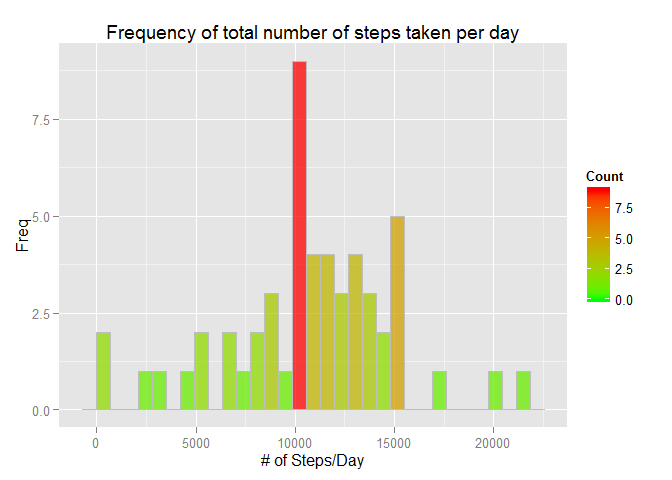

# Reproducible Research: Peer Assessment 1


## Loading and preprocessing the data

```r
library(dplyr, quietly = TRUE, warn.conflicts = FALSE)
library(ggplot2)
library(scales)

zipfile <- "activity.zip"
if(!file.exists(zipfile)) 
{
  print("error: file does not exist")
}
data <- tbl_df(read.csv(unz(zipfile, "activity.csv"), 
                  col.names=c("steps", "date", "interval"),
                  colClasses=c("numeric", "POSIXct", "numeric"),
                  stringsAsFactors=FALSE, 
                  header=TRUE))
#data <- data.raw %>% filter(!is.na(steps))

# freeing some memory
rm(data.raw)
```

```
## Warning in rm(data.raw): object 'data.raw' not found
```

```r
rm(zipfile)

str(data)
```

```
## Classes 'tbl_df', 'tbl' and 'data.frame':	17568 obs. of  3 variables:
##  $ steps   : num  NA NA NA NA NA NA NA NA NA NA ...
##  $ date    : POSIXct, format: "2012-10-01" "2012-10-01" ...
##  $ interval: num  0 5 10 15 20 25 30 35 40 45 ...
```


## What is mean total number of steps taken per day?

1. Calculate the total number of steps taken per day

```r
totalStepsPerDay <- data %>% filter(!is.na(steps)) %>% group_by(date) %>% summarize(tot = sum(steps))
totalStepsPerDay
```

```
## Source: local data frame [53 x 2]
## 
##          date   tot
## 1  2012-10-02   126
## 2  2012-10-03 11352
## 3  2012-10-04 12116
## 4  2012-10-05 13294
## 5  2012-10-06 15420
## 6  2012-10-07 11015
## 7  2012-10-09 12811
## 8  2012-10-10  9900
## 9  2012-10-11 10304
## 10 2012-10-12 17382
## 11 2012-10-13 12426
## 12 2012-10-14 15098
## 13 2012-10-15 10139
## 14 2012-10-16 15084
## 15 2012-10-17 13452
## 16 2012-10-18 10056
## 17 2012-10-19 11829
## 18 2012-10-20 10395
## 19 2012-10-21  8821
## 20 2012-10-22 13460
## 21 2012-10-23  8918
## 22 2012-10-24  8355
## 23 2012-10-25  2492
## 24 2012-10-26  6778
## 25 2012-10-27 10119
## 26 2012-10-28 11458
## 27 2012-10-29  5018
## 28 2012-10-30  9819
## 29 2012-10-31 15414
## 30 2012-11-02 10600
## 31 2012-11-03 10571
## 32 2012-11-05 10439
## 33 2012-11-06  8334
## 34 2012-11-07 12883
## 35 2012-11-08  3219
## 36 2012-11-11 12608
## 37 2012-11-12 10765
## 38 2012-11-13  7336
## 39 2012-11-15    41
## 40 2012-11-16  5441
## 41 2012-11-17 14339
## 42 2012-11-18 15110
## 43 2012-11-19  8841
## 44 2012-11-20  4472
## 45 2012-11-21 12787
## 46 2012-11-22 20427
## 47 2012-11-23 21194
## 48 2012-11-24 14478
## 49 2012-11-25 11834
## 50 2012-11-26 11162
## 51 2012-11-27 13646
## 52 2012-11-28 10183
## 53 2012-11-29  7047
```

2. If you do not understand the difference between a histogram and a barplot, research the difference between them. Make a histogram of the total number of steps taken each day


```r
#totalStepsPerDay <- data %>% group_by(date) %>% summarize(tot = sum(steps))

ggplot(totalStepsPerDay, aes(date)) +
      geom_histogram(alpha=1/4) +
      labs(title = "Total number of steps taken per day") +
      labs(x = "Day", y = "# of Steps") +
      scale_y_continuous(labels = comma)
```

```
## stat_bin: binwidth defaulted to range/30. Use 'binwidth = x' to adjust this.
```

 


3. Calculate and report the mean and median of the total number of steps taken per day

```r
meanStepsPerDay <- data %>% filter(!is.na(steps)) %>% group_by(date) %>% summarize(mn = mean(steps))
ggplot(meanStepsPerDay, aes(date, mn)) +
      geom_line(size=2, alpha=1/4) +
      geom_point(size = 4, alpha = 1/2)  +	
      labs(title = "Mean number of steps taken per day") +
      labs(x = "Day", y = "Mean # of Steps")
```

 


```r
medianStepsPerDay <- data %>% filter(!is.na(steps) & steps > 0) %>% group_by(date) %>% summarize(mn = median(steps))
ggplot(medianStepsPerDay, aes(date, mn)) +
      geom_line(size=2, alpha=1/4) +
      geom_point(size = 4, alpha = 1/2)  +  
      labs(title = "Median number of steps taken per day") +
      labs(x = "Day", y = "Median # of Steps")
```

 

## What is the average daily activity pattern?


## Imputing missing values


## Are there differences in activity patterns between weekdays and weekends?
